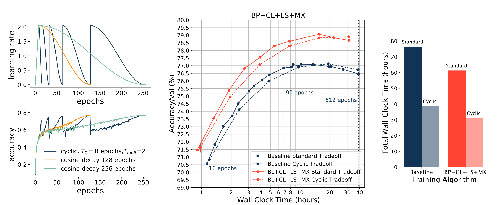

# Fast Benchmarking of Accuracy vs. Training Time with Cyclic Learning Rate Schedules

This small repository contains data and notebooks for experiments with cyclic learning rate schedules from the workshop paper [``Fast Benchmarking of Accuracy vs. Training Time with Cyclic Learning Rates''](https://arxiv.org/abs/2206.00832) (Portes et al. 2022).

Benchmarking the tradeoff between neural network accuracy and training time is computationally expensive. In this study, we show how a multiplicative cyclic learning rate schedule can be used to construct a tradeoff curve in a single training run. We generate cyclic tradeoff curves for combinations of training methods such as Blurpool, Channels Last, Label Smoothing and MixUp, and highlight how these cyclic tradeoff curves can be used to evaluate the effects of algorithmic choices on network training efficiency.



Data was collected using the [MosaicML Composer library](https://github.com/mosaicml/composer) for PyTorch, and all experiments were run on the [Mosaic Cloud](https://www.mosaicml.com/).

If you have questions or comments, please feel free to to reach out to jacob [arroba] mosaicml.com

```
@article{portes2022fast,
  title={Fast Benchmarking of Accuracy vs. Training Time with Cyclic Learning Rates},
  author={Portes, Jacob and Blalock, Davis and Stephenson, Cory and Frankle, Jonathan},
  journal={arXiv preprint arXiv:2206.00832},
  year={2022}
}
```
